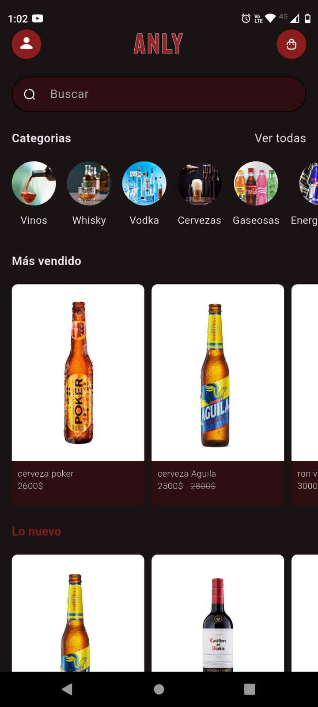
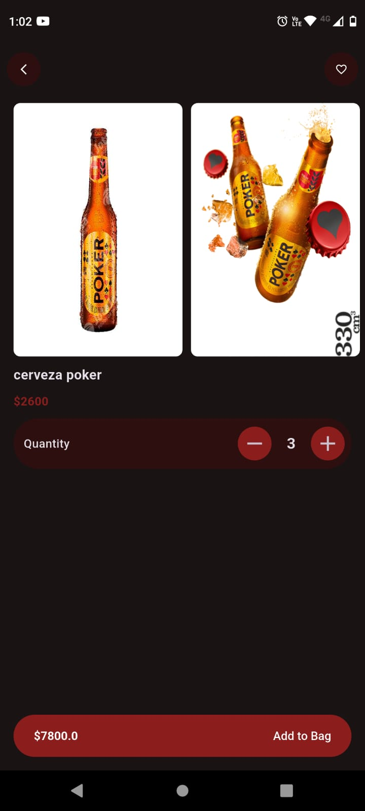
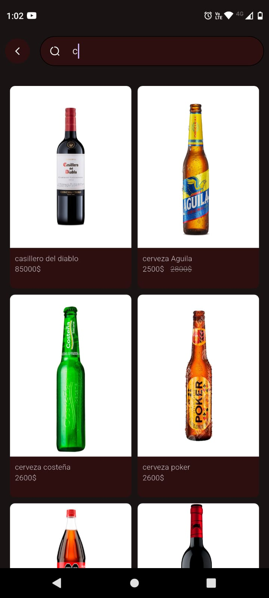
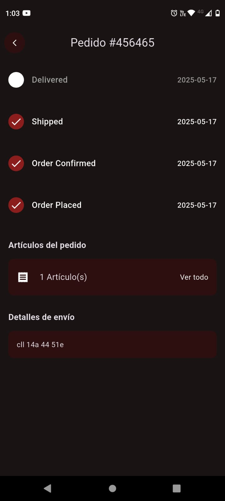

# E-commerce Anly - Flutter

Una aplicación móvil de comercio electrónico desarrollada en Flutter, que permite a los usuarios explorar productos, agregarlos a favoritos y realizar compras de manera rápida y sencilla.

---

## 🚀 Características

- 🛍️ Listado de productos con imágenes y precios
- ❤️ Favoritos personalizados por usuario
- 🔍 Búsqueda por título
- 👤 Autenticación de usuarios con Firebase
- 🌓 Soporte para tema oscuro
- 📦 Arquitectura limpia con uso de Cubit y Repositorios
- 🧪 Validaciones de formulario
- 🌐 Backend con Firebase Firestore

---

## 📸 Capturas de pantalla

| 🏠 Pantalla principal |
|-----------------------|---------------------|
|  |  |

| 🛒 Lista de productos | 📦 Detalle de producto |
|----------------------|------------------------|
|  |  |

| [**Inicio de sesión**](https://github.com/davidmarint/Ecommerce-anly/tree/readme/lib/presentation/auth/pages) | 
|------------|-------------| 
|   |   |
| [**Registro de usuarios**]   | 
|------------|-------------| 
|   |   |  

| [**Visualizacion de productos**]   | 
|------------|-------------| 
|   |   |

 | [**Busqueda de productos**]  |  
 |------------|-------------| 
 |  |   |

| [**Carrito de compras**] |
|--|--|
|  | 
  
|

|[**Seguimiento del pedido**] |

|  |  |

---

## 🛠️ Tecnologías y paquetes usados

- Flutter
- Firebase (Auth, Firestore)
- Bloc/Cubit (flutter_bloc)
- dartz
- get_it
- cached_network_image
- google_fonts

---

## ⚙️ Instalación

1. Clona este repositorio:

git clone https://github.com/davidmarint/Ecommerce-anly.git

2. Navega al directorio del proyecto

3. instala las dependencias de Flutter desde el terminal 

 - flutter pub get

4. Configura Firebase
Asegúrate de tener un proyecto en Firebase Console y sigue estos pasos:

🔹 Android:
Coloca tu archivo google-services.json en:

- android/app/google-services.json

🔹 iOS:
Coloca tu archivo GoogleService-Info.plist en:

- ios/Runner/GoogleService-Info.plist

5. Corre la aplicación
Conecta un emulador o dispositivo físico y ejecuta:

- flutter run

---

## ✅ Estado actual
- Pantalla de inicio

- Visualización de productos

- Funcionalidad de favoritos

- Autenticación

- Carrito de compras

-  Pasarela de pago (pendiente)

---
